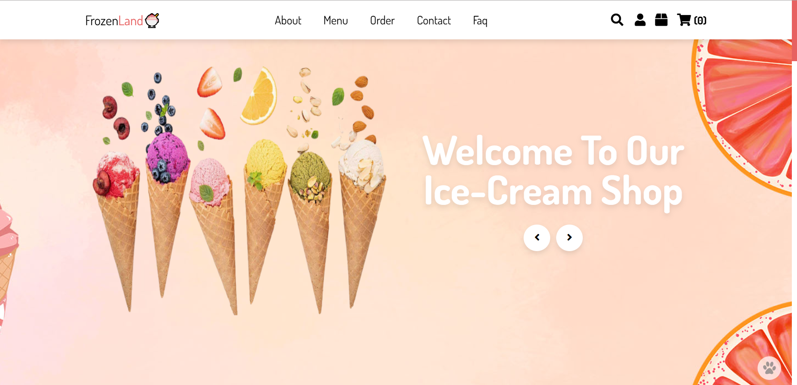
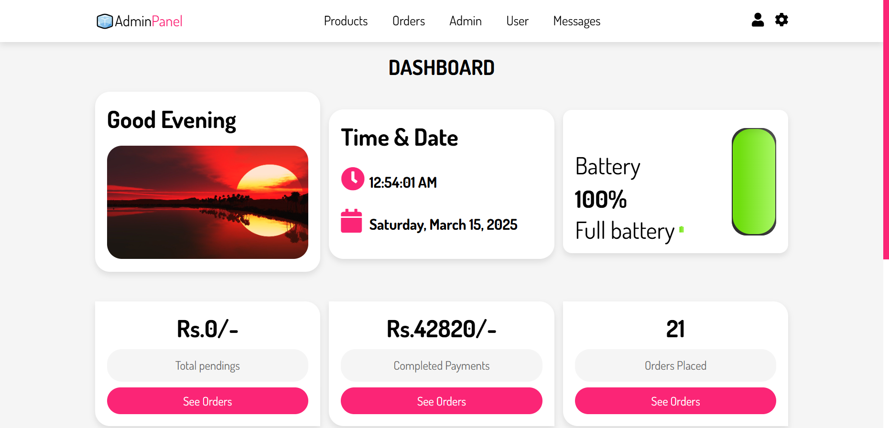

###                    
   **📌 Frozen Land - Ice Cream Website 🍦**  
**A beautifully designed ice cream ordering website built with PHP, CSS, and XAMPP.**  

<p align="center">
   
</p>

---

## **🚀 Features**
✅ User-friendly interface for ordering ice cream  
✅ Admin panel to manage orders & payments  
✅ Secure database connection with MySQL (XAMPP)  
✅ Responsive design for all devices  
✅ Payment status update system  

---

## **🛠️ Technologies Used**
- **Frontend:** HTML, CSS, JavaScript  
- **Backend:** PHP  
- **Database:** MySQL (XAMPP)  

---

## **🖥️ Installation & Setup**
### **1️⃣ Clone the Repository**
```bash
git clone https://github.com/yourusername/frozen-land.git
```

### **2️⃣ Move the Project to XAMPP**
- Copy the project folder to `C:/xampp/htdocs/`

### **3️⃣ Setup the Database**
- Open **XAMPP Control Panel** and **Start** Apache & MySQL  
- Go to `http://localhost/phpmyadmin/`  
- Create a new database **flize_db**  
- Import `database/flice_db.sql`  

### **4️⃣ Configure Database Connection**
- Open `config.php` and update database credentials:  
```php
$servername = "localhost";
$username = "root";
$password = "";
$dbname = "flize_db";
```

### **5️⃣ Run the Project**
- Open your browser and go to:  
  ```
  http://localhost/frozen-land/
  ```

---

## 📸 Screenshots

### 🖥️ Frontend View


### 🔧 Backend View
                    
  
---

## **🔗 Live Demo**  
🚀 *Coming soon...* 

---

## **📌 Author**
👨‍💻 **Viraj Induruwa**  
📍 Panadura, Sri Lanka  
🔗 [LinkedIn](https://www.linkedin.com/in/viraj-induruwa/) | [GitHub](https://github.com/Viraj-005)  

---

## **📜 License**
This project is **open-source** and free to use. Feel free to contribute! 🎉  

---

### **✨ Enjoy Your Ice Cream Experience! 🍦🚀**  
